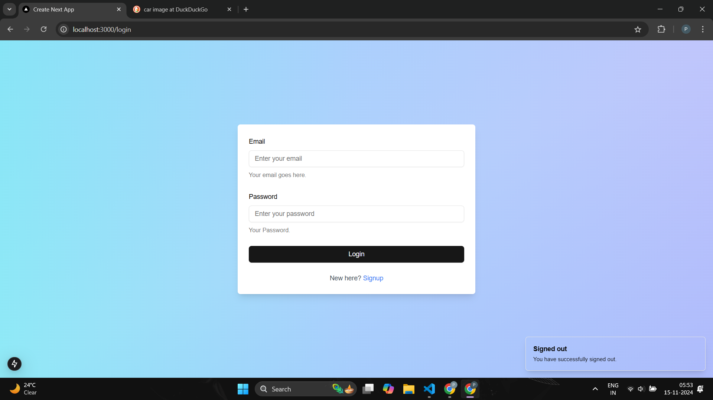
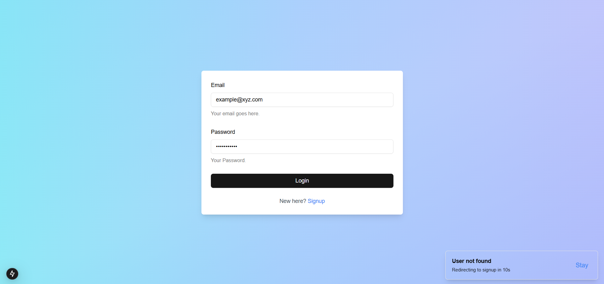
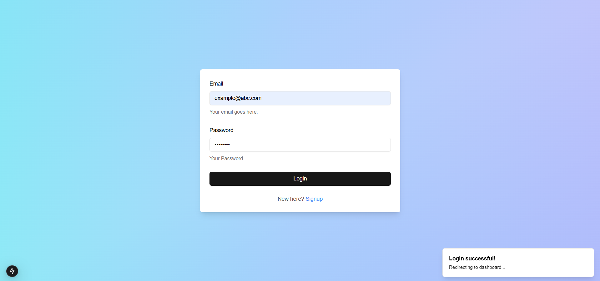
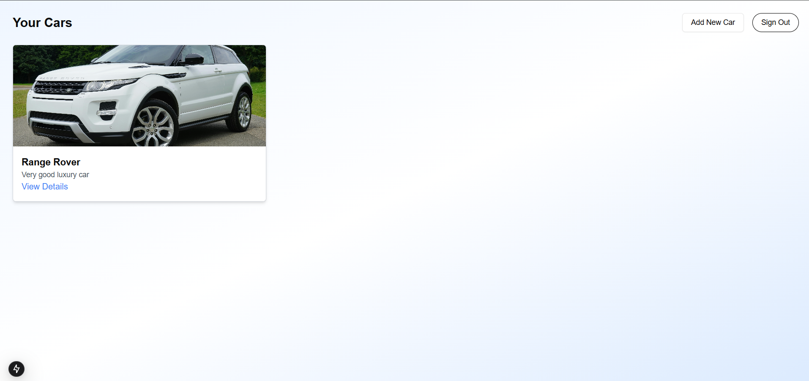
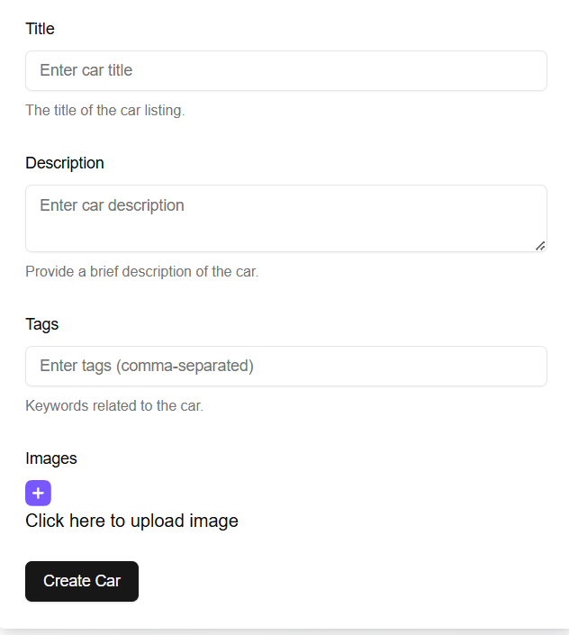

# 🚗 Car Management App

This is a **Car Management App** created as an assignment within tight time constraints. The app provides a user-friendly interface for managing cars, with core functionalities that allow users to authenticate, view, create, and manage cars. The project demonstrates skills in full-stack development, user authentication, and CRUD operations.

---

## 🛠️ Implemented Functionalities

- **User Authentication** 🔐  
  Secure login and session management using JWT tokens to ensure user access is protected.

- **Cars View** 🚘  
  Users can view all the cars they have added, including images, titles, and descriptions.

- **Create New Car** ➕  
  Users can add a new car to the system with details like title, description, and images.

- **CRUD Operations** 🔄  
  - **Create**: Add new cars.
  - **Read**: View the list of cars.
  - **Update**: Edit car details.
  - **Delete**: Remove cars from the list.

---

## 🚀 Features

- **Responsive Design** 📱  
  Optimized for both desktop and mobile devices to ensure a seamless experience.

- **Error Handling** ⚠️  
  Proper error messages and validations for a smooth user experience.

- **Toast Notifications** 🎉  
  Display success or error messages after actions like sign-in, adding a car, or signing out.

---

## 🔧 Technologies Used

- **Frontend**:  
  - React.js ⚛️  
  - Next.js 🌐  
  - Tailwind CSS 🎨

- **Backend**:  
  - Node.js 🖥️  
  - MongoDB  🗃️

- **Authentication**:  
  - JSON Web Tokens (JWT) 🔑

- **Cloud Storage**:  
  - Cloudinary for storing car images ☁️

---

## 📷 Screenshots



 
 
_Your Car Dashboard: View, Add, and Manage Cars_

---

## 🏁 How to Run Locally

1. **Clone the repository**:
   ```bash
   git clone https://github.com/yourusername/car-management-app.git

Install dependencies: Navigate to the project folder and run:

npm install
Start the app: Run the development server:

npm run dev
Visit the app on http://localhost:3000.


📧 Contact
Feel free to reach out if you have any questions or suggestions!

GitHub: @prathameshppawar
⚖️ License

🌟 Thanks for checking out this project! 🌟